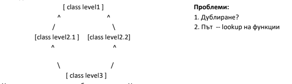
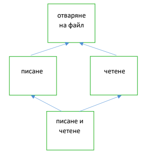

# Обектно-ориентирано програмиране. Подтипов и параметричен полиморфизъм. Множествено наследяване
## Виртуални функции и подтипов полиморфизъм. Динамично свързване. Абстрактни методи и класове. Масиви от обекти и от указатели към обекти.

**Полиморфизъм** - едно име, но много различни имплементации; 
***Подтиповият полиморфизъм*** се постига чрез наследяване.

* **Статично свързване** - изборът на функция става по време на компилация
* **Динамично свързване** - изборът на метод става по време на изпълнение


```cpp
#include <iostream>
#include <string>
#include <vector>
#include <cmath>

struct Shape {
    std::string label;
    Shape(const std::string& str): label(str) {}
    virtual double area() const {
        return -1;
    }
    virtual Shape* copy() const = 0;
    virtual ~Shape() {}
};
struct Circle: Shape {
    static const double pi;
    
    double r;
    Circle(const std::string& str, double r): Shape(str), r(r) {}
    virtual double area() const override { return r * r * pi; }
    virtual Shape* copy() const override { return new Circle(*this); }
};

const double Circle::pi = 2 * std::asin(1);

struct Rectangle: Shape {
    double h;
    double w;
    
    Rectangle(const std::string& str, 
              double h, double w): Shape(str), h(h), w(w) {}
    virtual double area() const override { return h * w; }
    virtual Shape* copy() const override { return new Rectangle(*this); }
};

int main() {
    std::vector<Shape*> shapes; // хетерогенен контейнер
    
    Shape* r1 = new Rectangle("rectangle 1", 2, 21); // area 42
    Shape* c1 = new Circle("circle 1", 1); // area ~3.14
    Shape* r2 = new Rectangle("rectangle 1", 23, 3); // area 69
    
    shapes.push_back(r1);
    shapes.push_back(c1);
    shapes.push_back(r2);
    
    for(int i = 0; i < shapes.size(); ++i) {
        std::cout << shapes[i] -> area() << '\n';
    }

    Shape* unknown = shapes[0] -> copy();
    std::cout << unknown -> area(); // area 42
    delete unknown;
    
    for(int i = 0; i < shapes.size(); ++i) {
        delete shapes[i];
    }
    return 0;
}
```

За да се осъществи динамичното свързване, в C++ се използва механизма на <u>**виртуалните функции**</u>. 

Когато обявим дадена член-функция **f** да бъде виртуална в базов клас **A**, тогава ако някой негов наследник **B**  имплементира версия на функцията(т.е. със същата/съвместима декларация), то при условие, че извикаме **f** през указател от тип `A*` или референция към **A**, който сочи/която реферира обект от класа **B**, ще бъде извикана имплементацията на **B**. 

В примера, **area** ще дава коректни резултати от извикването си, макар и в дефиницията си в **Shape** класа да дава стойност -1.

* **Абстрактен метод** наричаме метод, който не изисква имплементация, но трябва да бъде имплементиран от всеки неабстрактен клас-наследник. 

* **Абстрактен клас** наричаме клас, който има поне 1 абстрактен метод. 

В C++ абстрактните методи реализираме с **pure virtual** нотацията, именно виртуални функции и `=0`, както при метода `copy` по-горе.
Следователно в примера класът Shape е абстрактен.

<u>**Масиви от обекти и указатели към обекти**</u>
Няма как да съхраняваме обекти без загуба на информация в масив от тип базов клас. За тази цел обаче можем използваме масив от указатели и така бихме могли да работим на по-абстрактно ниво -- без да се интересуваме от това какъв тип е конкретен наследник, благодарение на механизма на виртуалните функции, както илюстрира примера.


## Параметричен полиморфизъм. Шаблони на функция и на клас

Параметричният полиморфизъм - имплентация, която параметризира и по тип. 
Постигаме като реализираме функции/класове с едно и също име, но с различни типове(различен брой/типове параметри)

Параметричния полиморфизъм можем да постигнем чрез шаблони, които ни дават възможност за генерично програмиране:  

```cpp
template<class T>
const T& max(const T& lhs, const T& rhs) {
    return lhs < rhs ? rhs : lhs;
}

// max<int>(3, 4);
// max<std::string>("pesho", "gosho");

template<class T>
class Vector {
    T* data;
    std::size_t cap;
    std::size_t size;
    //...
};

```

В C++ компилаторът създава код за всеки тип, с който е извикан шаблонът. 

## Множествено наследяване

В някои езици за програмиране, клас може да има повече от един родител. 

***Диамантеният проблем***, в най-основния си вариант, се състои в следната ситуация на множествено наследяване.


Посочената ситуация невинаги е проблемна, понякога по условие искаме дублирането. 
В останалите случаи, потенциално решение би било виртуалното наследяване. 

Нека имаме класове B1 и B2, които наследяват класа A. Нека също имаме клас C - трето ниво, което наследява B1 и B2.  
Ако B1 и B2 наследяват A виртуално, то в C B1 и B2 споделят една и съща основа за A. 



Тук напр. не искаме 2 основи от класа за отваряне на файл, т.к. не искаме по 2 пъти да отваряваме файл.