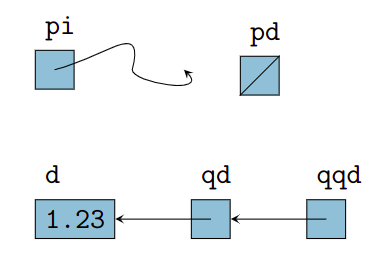
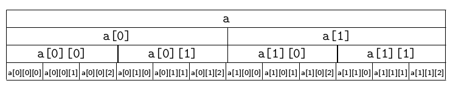

# Процедурно програмиране - указатели, масиви, рекурсия 
## Указатели и указателна аритметика 

### Тип указател 

* Интегрален нечислов тип
* Параметризиран тип: ако **T** е тип данни, то **T*** е тип “указател към елемент от тип **T**”
* Физическо представяне: цяло число, указващо адреса на указваната **lvalue** в паметта
* Стойностите от тип “указател” са с размера на машинната дума
    * 32 бита (4 байта) за 32-битови процесорни архитектури
    * 64 бита (8 байта) за 64-битови процесорни архитектури


**Указателят** е обект, който съдържа като своя стойност адрес в паметта - адресът на началото на стойността, която сочи, а типът носи информация за размера на съхраняваната стойност. 

<u>**Операции с указатели**</u>  
* **рефериране**(`&<lvalue>`) - вземаме адреса
* **дерефериране** (`*<указател>`) - достъп до соченото от указателя
* сравнение (`==`, `!=`, `<`, `>`, `<=`, `>=`)
* **указателна аритметика** (`+`, `-`, `+=`, `-=`, `++`, `--`)
* извеждане - оператор `<<`
* *няма въвеждане*

```cpp
<тип>* <име> (=<стойност>);  
``` 
Указателите имат неутрална стойност `nullptr`, референциите нямат.

```
ptr += x // екв. на ptr отместено нядясно с sizeof(T) * x байта
ptr + x 
ptr - x
++ptr
--ptr

```

void* ptr указател - не може да се деферерира, нямаме указателна аритметика, може да сочи към променлива от произволен тип 


<u>**Напр.**</u>  
```cpp
int* pi;
double* pd = nullptr; // не сочи нищо
double d = 1.23;
double* qd = &d;
double** qqd = &qd;
```


## Едномерни и многомерни масиви - индексиране. Сортиране и търсене в едномерен масив - основни алгоритми 
**Логическо представяне** - масивът е съставен тип данни, който представя **крайнa** **редицa** от **еднотипови** елементи и позволява **произволен достъп** до всеки негов елемент по индекс. 

**Физическото представяне** на масив е "непрекъснато" парче от оперативната памет. 

`<тип> <идентификатор>[размер];`

<u>**Дефиниране на масив в C++**</u>
```cpp
<тип> <индентификатор> [[<константа>]] [= {<израз> {, <израз>}}];
```

<u>**Напр.**</u> 
```cpp
bool b[10];
double x[3] = {0.5, 1.5, 2.5};
int a[] = {3 + 2, 2 * 4}; // екв. int a[2] = {5, 8};
```
В C++ има много тясна връзка между указатели и масиви - ***името на масив представлява(преобразува се до по-точно) константен указател към първия му елемент***.  

💡 <u>**забл.**</u> незадължително указател към константа, а указател, който не може да мени стойността си. 

Указателната аритметика позволява по дадена отправна точка в паметта(адрес) да реферираме съседни на нея клетки, като за целта трябва да укажем колко клетки напред или назад в паметта искаме да прескочим.   Тук изискването за хомогенност на елементите е съществено, защото то задава колко байта да бъдат прескочени. 

```cpp
    <указател> [+ | -] <цяло_число>
    <цяло_число> + <указател>
``` 

<u>**Индексиране**</u>

В C++ индексирането започва от 0. 

💡 <u>**забл.**</u> Съгласно това, че името на масив arr се преобразува до константен указател към първия елемент на масива arr[0], arr[i] е еквивалентно на *(arr + i), където i е индекс. По този начин можем да получим адрес, който е извън рамките на масива, а дереферирането на такъв указател е с недефинирано поведение.    

Ще разгледаме примери за указателна аритметика в реализацията на някои алгоритми за сортиране и търсене. 

### Многомерни масиви 

|Масив, чиито елементи...|наричаме           |
|------------------------|-------------------|
|са масиви               |многомерен масив   |
|не са масиви            |едномерен масив    |
|са n-мерни масиви       |(n + 1)-мерен масив|


<u>**Синтаксис**</u>

```cpp
<тип> <идентификатор> [[<константа>]]{[<константа>]} [ = { <израз> {, <израз> } } ] ;
// първата размерност може да бъде изпусната, ако е даден инициализиращ списък
```

<u>**Напр.**</u>

```cpp 
double b[5][6] = {0.1, 0.2, 0.3, 0.4};
int c[4][5] = {{1, 2}, {3, 4, 5, 6}, {7, 8, 9}, {10}};
float f[][2][3] = { {{1.2, 2.3, 3.4}, {4.5, 5.6, 6.7}},
                    {{7.8, 8.9, 9.1}, {1.2, 3.4, 3.4}},
                    {{5.6},{6.7, 7.8}} };
```

<u>**Физическо представяне**</u>





### Сортиране на едномерен масив - основни алгоритми 

Ще разгледаме алгоритмите за сортиране на масив във възходящ ред. Наредбата може да се определя и по друга логика, но е аналогично.

<u>**1. Selection Sort(сортиране по метода на пряката селекция)**</u>

```cpp
1. void selection_sort(int* arr, int len) {
2.    int best_id = 0;
3.    for(int i = 0; i < len - 1; ++i) {
4.        best_id = i;
5.        for(int j = i + 1; j < len; ++j) {
6.            if(arr[best_id] > arr[j]) {
7.                best_id = j;
8.            }
9.        }
10.       std::swap(arr[best_id], arr[i]);
11.   }
12.}
```

* Коректността се дължи на инварианта, че след всяко стигане на ред 10, [arr[0], arr[1], arr[2], ..., arr[i]] е префикс на сортирания масив. 
* $\Theta(n^2)$ сложност по време, $\Theta(1)$ сложност по памет

<u>**2. Bubble Sort(сортиране по метода на мехурчето)**</u>

```cpp
1. void bubble_sort(int* arr, int len) {
2.     bool done = false;
3.     for(int i = 0; i < len - 1 && !done; ++i) {
4.         done = true;
5.         for(int j = 0; j < len - i - 1; ++j) {
6.             if(arr[j] > arr[j + 1]) {
7.                 std::swap(arr[j], arr[j + 1]);
8.                 done = false;
9.             } 
10.         }
            // ако done има стойност true тук, то няма инверсии и масивът е сортиран
11.     }
12. }
```
* Коректността се дължи на инварианта, че при всяко достигане на ред 4, [arr[n - i], arr[n - i + 1], ..., arr[n - 1]] е суфикс на сортирания масив.
* $\Theta(n^2)$ сложност по време, $\Theta(1)$ сложност по памет  

<u>**3. Insertion Sort(сортиране с вмъкване)**</u>

```cpp
1. void insert_in_sorted(int* arr, int elem, int len) {
2.     int i = len;
3.     while(i > 0 && arr[i - 1] > elem) {
4.         arr[i] = arr[i - 1];
5.         --i;
6.     }
7.     arr[i] = elem;
8. }
9. 
10. void insertion_sort(int* arr, int len) {
11.     for(int i = 1; i < len; ++i) {
12.        insert_in_sorted(arr, arr[i], i);
13.     }
14. }
```
* Коректността се дължи на това, че при всяко достигане на ред 12 е в сила, че [arr[0], arr[1], arr[2], ..., arr[i]] е сортиран. 
* $\Theta(n^2)$ сложност по време, $\Theta(1)$ сложност по памет  

<u>**4. Merge Sort(сортиране чрез сливане)**</u>
```cpp
int* copy(const int* begin, const int* end, int* buffer) {
    while(begin < end) {
        *buffer++ = *begin++;
    }
    return buffer; // return the end
}
int* merge(const int* begin1, const int* end1, 
           const int* begin2, const int* end2, 
           int* buffer) {

    while(begin1 < end1 && begin2 < end2) {
        *buffer++ = *begin1 < *begin2 ? *begin1++ : *begin2++;
    }
    buffer = copy(begin1, end1, buffer);
    buffer = copy(begin2, end2, buffer);
    return buffer; //  връщаме края 
}

void merge_sort(int* arr, int len) {
    if(len < 2) {
        return;
    }
    int* mid = arr + len / 2;
    merge_sort(arr, mid - arr);
    merge_sort(mid, arr + len - mid);
    
    int* buff_beg = new int[len];
    int* buff_end = merge(arr, mid, mid, arr + len, buff_beg);
    copy(buff_beg, buff_end, arr);
    
    delete[] buff_beg;
}
```

* Коректността се дължи на коректността на рекурсивната декомпозиция 
* $\Theta(n * lg n)$ сложност по време

<u>**5. Quick Sort(бързо сортиране)**</u>
```cpp
int* lomuto(int* begin, int* end, int pivot) {
    int* read = begin;
    int* write = begin;
    while(read < end) {
        if(*read < pivot) {
            std::swap(*write, *read);
            ++write;
            ++read;
        } else {
            ++read;
        }
    }
    return write; // return partition pointer
}
void quick_sort(int* begin, int* end) {
    if(begin + 1 >= end) {
        return;
    }   
    int pivot = *begin;
    int* pivot_pointer = lomuto(begin, end, pivot);
    quick_sort(begin, pivot_pointer + 1);
    quick_sort(pivot_pointer + 1, end);
}
```
* Отново коректността се дължи на рекурсивната декомпозиция
* $\\О(n* lgn)$ сложност по време ***амортизирано***  

<u>**7. Binary Search(двоично търсене на елемент в сортиран масив)**</u>
```cpp
const int* binary_search(const int* begin, const int* end, const int elem) {
    if(begin == end) {
        return end;
    } 
    
    const int* mid = begin + (end - begin) / 2; 
    if(*mid == elem) {
        return mid;
    } 
    if(*mid > elem) {
        return binary_search(begin, mid, elem);
    }
    return binary_search(mid + 1, end, elem);
}

```

* Отново коректността се дължи на рекурсивната декомпозиция
* $\\О(lgn)$ сложност по време   

метод на мехурчето, пряка селекция и вмъкване

Ако масивът не е сортиран, можем да приложим линейна проверка за принадлежност на елемент. 

## Рекурсия - пряка и косвена рекурсия, линейна и разклонена рекурсия 
| За да разбере човек рекурсията, трябва да разбере рекурсията. 

<u>**деф.**</u> Рекурсивна функция наричаме функция, която извиква себе си **пряко** или **косвено**.  

<u>**деф.**</u> Една функция ***$f_1$*** е косвено рекурсивна, когато съществува редица от извиквания от вида ***$f_1$$\to$$f_2$$\to$...$f_{n - 1}$ $\to$ $f_1$***
// f извиква друга функция, която извиква f пряко или косвено
<u>**деф.**</u> Една функция ***f1*** е пряко рекурсивна, ако в тялото си се извиква. 

Примери са горните реализациите на някои от алгоритмите за сортиране - `merge_sort` и `quick_sort`, както и алгоритъма за двоично търсене в сортиран масив. 

💡 <u>**забл.**</u> Всяка програма с цикли може да се напише с рекурсия и обратно.   

<u>**деф.**</u> Една рекурсивна функция ***$f$*** наричаме **линейно рекурсивна**, когато прави единствено рекурсивно извикване в тялото си.  

<u>**деф.**</u> Една рекурсивна функция ***$f$*** наричаме **разклонена**, когато прави повече от едно рекурсивно извикване в тялото си.  

<u>**Напр.**</u>
```cpp
// пример за линейна рекурсия 
unsigned int factorial(unsigned int n) {
    if(!n) {
        return 1;
    }
    return n * factorial(n - 1); // може да се оптимизира с tail call
}
```

```cpp
// пример за косвена рекурсия
// забл. такива са и merge и quicksort
unsigned int fibs(unsigned int n) {
    if(n == 0 || n == 1) {
        return n;
    }
    return fibs(n - 1) + fibs(n - 2);
}

```


