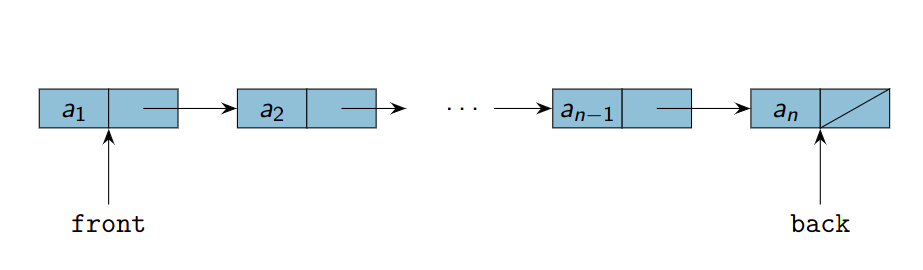
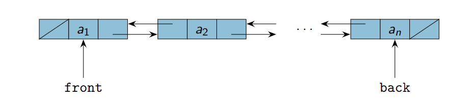

# Структури от данни. Стек, опашка, списък, дърво. Основни операции върху тях. Реализация
0. **Структури от данни** – дефиниране на понятието.  
Структурата от данни представлява съвкупност от данни(стойности), връзките между тях и допустимите приложими операции върху тях. 
Докато абстрактиният тип данни(АТД) задава логическото описание на типа данни, СД задава физическо описание, т.е. представляват схеми за организация на даден вид данни в паметта на компютъра. 

## 1. Списък. 
Списъкът преставлява СД, която представя редица от елементи. За такава редица се предполага, че нямаме произволен достъп до елементите, а последователен. 
* празният списък е списък
* списък с глава h и опашка t, където h е елемент, а t - списък 

Физическото представяне е от възли, пазещи стойност на елемент-данна, както и препратка към следващ и/или предишен възел. Предполага се, че възлите могат да бъдат разпръснати из произволни места от оперативната памет. В зависимост от това колко и какви препратки пазим при реализацията, разглеждаме следните разновидности, заедно със сложностите им по време за някои основни операции: 

<u>**Списък с една връзка**</u> 



Връзките между възлите са от типа ***next*** или екв. ***previous***. Ще разгл. такива от типа ***next***. 

* insert_after(<препратка към възел>) -  $\Theta(1)$  
* push_front - $\Theta(1)$ 
* push_back - $\Theta(n)$, където $n$ е броят елементи в списъка. 
* insert_before(<препратка към възел>) - $\Theta(n)$ 
* remove(<ключова стойност на елемент>) - $\Theta(n)$, БОО първо срещане
* erase_before(<препратка към възел>) - $\Theta(n)$
* erase_after(<препратка към възел>) -  $\Theta(1)$
* size - ако пазим размер като променлива, то  $\Theta(1)$, иначе - линейна по броя елементи
* търсене по ключ - $\Theta(n)$

[Реализация](./data-structures/singly-linked-list-simple.cpp)

<u>**Списък с две връзки**</u> 

Връзките между възлите са от типа ***next*** или екв. ***previous***. Ще разгл. такива от типа ***next***. 

* insert_after(<препратка към възел>) -  $\Theta(1)$  
* push_front - $\Theta(1)$ 
* push_back - $\Theta(1)$ 
* insert_before(<препратка към възел>) - $\Theta(1)$ 
* remove(<ключова стойност на елемент>) - $\Theta(n)$, БОО първо срещане
* erase_before(<препратка към възел>) - $\Theta(1)$
* erase_after(<препратка към възел>) -  $\Theta(1)$
* size - ако пазим размер като променлива, то  $\Theta(1)$, иначе - линейна по броя елементи
* търсене по ключ - $\Theta(n)$

[Реализация](./data-structures/doubly-linked-list.cpp)

## 2. Стек. 
**Логическо описание** - хомогенна линейна структура с организация LIFO(Last In First Out) 

**Операции**

* push(x) - добавяне на елемент на върха на стека 
* pop() - изключване на елемент от върха на стека
* peek() - елемент на върха на стека(последно добавен)

* empty() - проверка за празнота


<u>**Последователно представяне на стек**</u>

* използваме масив за контейнер, върхът на стека представлява индекс
* push представлява инкрементиране на индекса за върха и записване на елемента на тази позиция
* pop представлява декрементиране на индекса на върха

[Реализация](./data-structures/stack-sequential.cpp)

<u>**Свързано представяне на стек**</u>

* представяме стека като верига от двойни кутии(кутиите са потенциално разпръснати из оперативната памет)

* върхът на стека е началото на индуцирания свързан списък(или края, в зависимост от реализацията)
* добавянето е добавяне в началото 
* премахването е премахване в началото

Сложността по време и при двете представяния на операциите push и pop е $\Theta(1)$.

[Реализация](./data-structures/stack-linked.cpp)


## 3. Опашка
**Логическо описание** - хомогенна линкейна структура с организация FIFO(First In First Out)

**Операции**
* empty() - проверка за празнота
* enqueue(x) - включване на елемент в края на опашката
* dequeue() - изключване на елемент от началото на опашката
* head() - достъп до елемента в началото 

При реализациите е съществено, че имаме нужда да пазим както указател към началото на опашката, така и към края, за можем да реализираме FIFO стратегията. 

<u>**Статичната реализация**</u> 
* контейнерът е масив с фиксиран размер 
* модулна аритметика за преместване на пазените индекси

[Реализация](./data-structures/queue-static.cpp)

<u>**Динамична реализация**</u>
* както при статичната, но добавяме и начин за преоразмеряване при достигане на капацитета 

[Реализация](./data-structures/queue-dynamic.cpp)

<u>**Свързана реализация**</u>
* индуцира свързан списък, към който пазим указатели както към началото, така и към края 

[Реализация](./data-structures/queue-linked.cpp)


Операциите по **enqueue**, **dequeue**, **head**  и проверка за празнота са с константна сложност. 


## 4. Дървовидни структури от данни – кореново дърво и двоично кореново дърво.
Логическо описание. Начини за представяне в паметта. Дефиниране на клас, реализиращ кореново дърво или двоично кореново дърво.

### 4.1 Кореново дърво

**Логическо описание**

<u>**Деф.**</u>  Кореново дърво е $(X, T_1, ..., T_n)$, където 
* X е данна(корен)
* $T_1, ..., T_n$ са коренови дървета(поддървета), $n \geq 0$


<u>**Операции**</u>
* намиране на елемент с определено свойство 
* добавяне на елемент
* премахване на елемент
* проверка на свойства 
* обхождане 
    * в ширина
    * в дълбочина

При условие, че нямаме повече информация за това в какво отношение/наредба са елементите, реализациите биха имали сложност на добавяне/премахване и търсене на елемент $\Theta(N)$. Въпреки това, раклонеността би могла да бъде благоприятна за бързодействието. 

Когато елементите имат наредба обаче тези операции могат да имат сложност $\Theta(lgN)$ при реализиране на балансиране. 


#### 4.1.1 Кореново дърво с представяне на децата като (свързан)списък

```cpp
struct Node {
    int data;
    <списък от деца>

};
```

Може списъкът да бъде съхранен в масив, както можем да използваме и свързан списък. Реализацията с масив би могла да бъде подходяща, когато нямаме често добавяне на елементи "по средата", заради изместването, което може да се наложи. Съответно списъкът би бил подходящ, когато такива обстоятелства са в сила. 

[Реализация](./data-structures/rooted-linked-list-children.cpp)

#### 4.1.2 Кореново дърво с представяне left-child-right-sibling
Определя се от следната структура на възлите 

```cpp
struct Node {
    int data;
    Node* child = nullptr;
    Node* sibling = nullptr;
}

```

По този начин можем да превърнем всяко дърво с произволна разклоненост с такова с максимална разклоненост 2.

[Реализация](./data-structures/left-child-right-sibling.cpp)

### 4.2 Двоично кореново дърво 
Кореново дърво, чиято максимална разклоненост е 2
[Реализация](./data-structures/binary-rooted.cpp)

## 5. Двоично кореново дърво за търсене. 
Двоично кореново дърво, което използва наредбата между елементите, за да нареди наследниците си в ред, подходящ търсене. 

Операциите по търсене, добавяне и изтриване на елемент имат сложност $\Theta(h)$, където h е височината на дървото. Следователно, в най-добрия случай $\Theta(lgN)$, а в най-лошия $\Theta(N)$.

[Реализация](./data-structures/binary-search-tree.cpp)